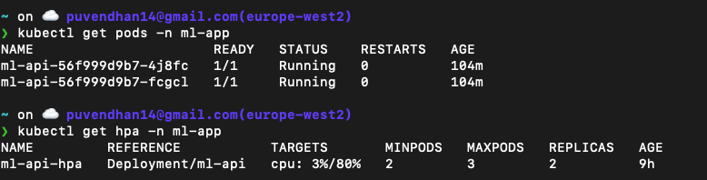
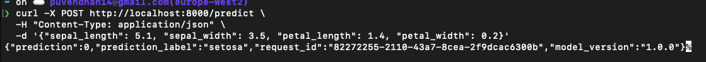
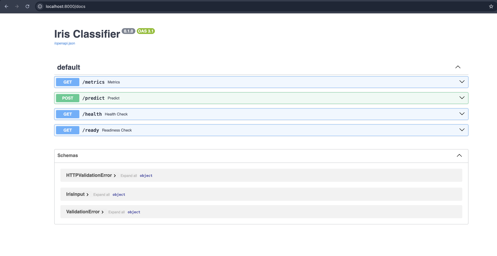
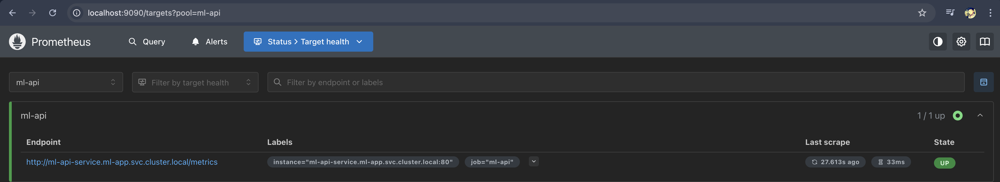

# 🚀 ML App - Iris Classifier
A containerized ML microservice to classify Iris species using FastAPI, Kubernetes, and CI/CD pipelines.

[🔗 GitHub Repository](https://github.com/Puvendhan/ml-app)

This project demonstrates how to train, package, deploy, and observe a simple Scikit-learn ML model using best practice in MLOps. It includes:

- A training pipeline that generates a serialised model and preprocessing pipeline.
- A FastAPI-based inference microservice.
- Kubernetes deployment with CI/CD.
- Observability with Prometheus and Loki.

---

## 📁 Project Structure

```bash
❯ tree
.
├── app
│   └── main.py
├── Dockerfile
├── k8s
│   ├── actionRunners.yaml
│   ├── helm
│   │   ├── Chart.yaml
│   │   ├── templates
│   │   │   ├── deployment.yaml
│   │   │   ├── gcp-sa-secret.yaml
│   │   │   ├── hpa.yaml
│   │   │   └── service.yaml
│   │   ├── values.yaml
│   │   ├── valuesProduction.yaml
│   │   └── valuesStaging.yaml
│   └── ingress.yaml
├── README.md
├── requirements.txt
├── tests
│   ├── integration
│   │   └── test_endpoints.py
│   └── unit
│       └── test_api.py
├── train.py
└── VERSION
```
---

## 1️⃣ How to Run the Training Pipeline

### ✅ Recommended: GitHub Actions (`ml-train.yml`)
- Automatically trains the model on push/dispatch.
- Serialises the `Pipeline` object with preprocessing + model.
- Uploads to a remote artifact store (e.g., Google Cloud Storage or GitHub release).

## 2️⃣ How to Build and Run the Inference Microservice

### 🔧 CI/CD via GitHub Actions
- ml-app-ci.yml: Runs tests, builds the Docker image, and pushes to a GCR (google container registry).

- ml-deploy.yml: Deploys Kubernetes manifests (Helm based) of the ml app into your gke cluster.


✅ CI/CD is fully automated from code commit to live deployment.

Snippet



## 3️⃣ How to Test the Microservice
🔁 Port-forward

```bash
kubectl port-forward svc/ml-api-service 8000:80 -n ml-app
```

```bash
curl -X POST http://localhost:8000/predict \
  -H "Content-Type: application/json" \
  -d '{"sepal_length": 5.1, "sepal_width": 3.5, "petal_length": 1.4, "petal_width": 0.2}'
```

Snippet




## 4️⃣ Design
### 🔁 Consistent Training and Inference

### ⚡ FastAPI Microservice
- FastAPI for async support and auto-generated Swagger docs.
- Built-in /health and /metrics endpoints.

Snippet



### 🧪 CI/CD
- GitHub Actions automate training, testing, building, and deployment.

- Separation of pipelines (ml-train.yml, ml-app-ci.yml, ml-deploy.yml) for maintainability.

## 📊 Observability

### Prometheus-compatible metrics via prometheus_fastapi_instrumentator.

Deployed the Prometheus into GKE cluster and added the scrape config for the ml app

```bash
    scrape_configs:
    - job_name: 'ml-api'
      static_configs:
      - targets: ['ml-api-service.ml-app.svc.cluster.local:80']
```

### Accessing the Prometheus endpoint using port-forward and it listens on localhost:9090

```bash
kubectl port-forward -n prometheus svc/prometheus-server 9090:80 
```
Snippet


### There are different approaches for logging (Loki+Promtail/Opentelemetry/ELK)
Loki + Promtail for structured logging of every request.


### Deploy Promtail
Promtail is an agent which collects the logs,runs as a DaemonSet 
Pushes logs to Loki using HTTP.

### Deploy Loki which collects, stores, and queries logs.
- Stores logs in object storage GCS which can be updated in the ConfigMap.
- Loki helm chart to deploy in K8s cluster

```bash
helm repo add grafana https://grafana.github.io/helm-charts
helm install --values values.yaml loki grafana/loki
```

### Deploy Grafana

- Grafana dashboards for real-time monitoring and logging.
- Add the Data Sources for the Prometheus and Loki
- Create Dashboards for various metrics

```bash
helm repo add grafana https://grafana.github.io/helm-charts
helm repo update
helm install grafana grafana/grafana \
  --namespace monitoring --create-namespace \
  --set adminPassword='admin' \
  --set service.type=ClusterIP
```


## ✅ Recommendations

### 🔄 GitOps - ArgoCD
- Adopt a GitOps workflow to manage your Kubernetes infrastructure declaratively.
- This enables version control, automated deployment rollbacks, and auditability.
- ArgoRollouts to implement progressive delivery strategies like Canary deployments & Blue-green deployments

### Blog - https://github.com/Puvendhan/gitops
- Explains deploying the Argo rollouts with Canary & Blue-green strategies
- Keda (AutoScaling based on events)
- ML workloads often need to scale based on Request rate (e.g., spike in /predict calls)
- If /predict endpoint exceeds 100 requests/min, scale up.
-  Based on Prometheus metrics like:
```bash
http_requests_total on /predict
inference_latency or failure count
```

### 🔐 Istio (Service Mesh for Zero Trust and MTLS)
- Manages the secure communication between the pods using mutual TLS (mTLS). Istio injects a sidecar proxy container in each workload.
- Istio sidecar proxies (Envoy) are automatically injected into pods to Encrypt pod-to-pod traffic
- Kiali dashboard visualises the realtime traffic between the pods,namespaces..etc.

TLS, Ingress, scaling, and versioning integrated.